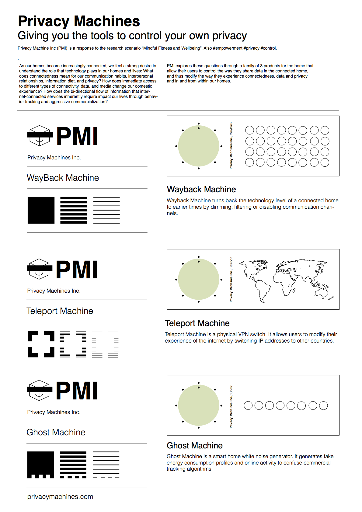
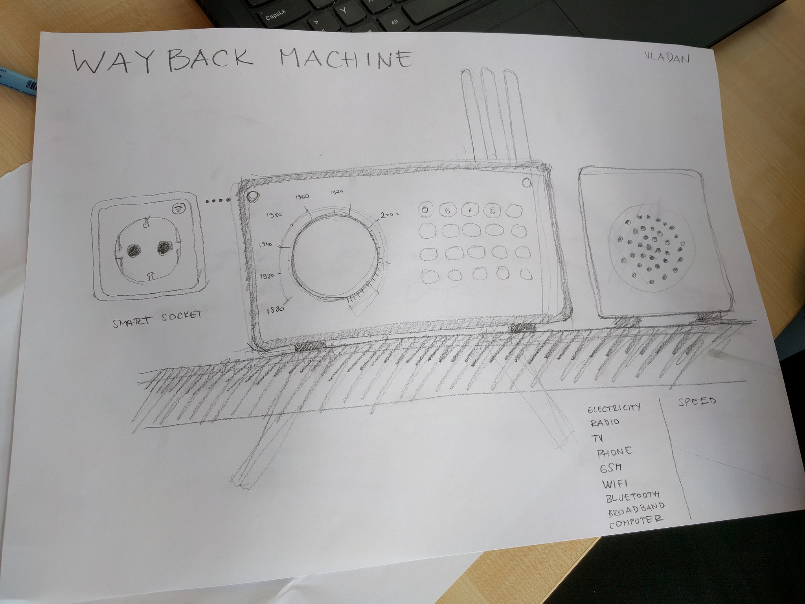
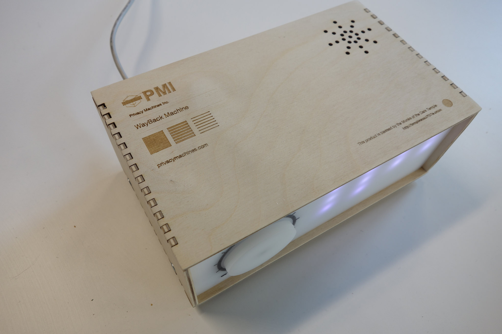
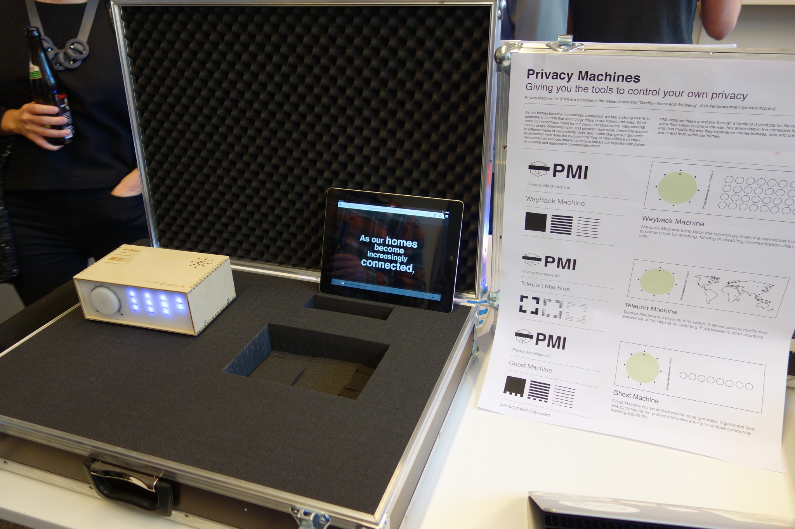

# Privacy Machines

### A family of machines giving you the tools to control your privacy. This prototype was developed during the Mozilla Open IoT Design Sprint in Berlin in response to the scenarios of "Mindfulness and well being." 

*By: Peter Bihr, Vladan Joler, Rachel Uwa and Martin Skelly at the Berlin Design Sprint, April 2016.*

